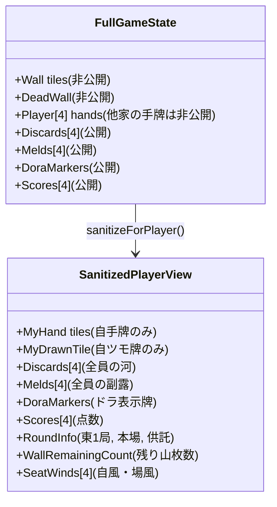

# ARCHITECTURE.md - システムアーキテクチャ設計書

本ドキュメントでは、ブラウザ麻雀ゲームおよびローカルAI CLI連携（Antigravity CLI / Claude Code）牌読みコーチングシステムの全体構造を定義します。

---

## 1. システム全体構成図

```
+-------------------------------------------------------------------------------+
| ブラウザ (Client - React + Vite + Tailwind CSS)                                 |
|                                                                               |
|  +-----------------------------------+  +----------------------------------+  |
|  |           麻雀卓 UI               |  |       AI牌読みコーチ パネル      |  |
|  | - 自手牌 / ツモ牌表示 (TileView)  |  | - 局面サマリー表示 (Markdown)   |  |
|  | - 4家の河 (捨て牌 / リーチ棒)    |  | - ワンクリック質問ボタン         |  |
|  | - 副露 (ポン/チー/カン)           |  | - チャットログ & 入力フィールド |  |
|  | - 点数表示 / ドラ / 場風・自風    |  | - バックエンドCLI切り替え (agy)  |  |
|  +-----------------+-----------------+  +----------------+-----------------+  |
|                    |                                     |                    |
|                    v                                     v                    |
|  +-------------------------------------------------------------------------+  |
|  |                      麻雀ゲームステート管理 (React Hook)                 |  |
|  | - ターン進行 / ユーザー操作受付                                         |  |
|  | - SanitizedPlayerView 抽出 (相手の非公開手牌を厳密に遮断)               |  |
|  +-----------------+-------------------------------------------------------+  |
+--------------------|----------------------------------------------------------+
                     | HTTP POST /api/coach/chat (プロンプト + 局面データ)
                     v
+-------------------------------------------------------------------------------+
| ローカルCLIブリッジサーバー (Node.js / Express : Port 3001)                     |
|                                                                               |
|  +-------------------------------------------------------------------------+  |
|  | Express Router (/api/coach)                                             |  |
|  | - /chat        : 質問と局面テキストを受け取りCLIプロセスを起動          |  |
|  | - /cli-status  : agy / claude コマンドのローカル利用可能状態を確認       |  |
|  +-----------------+-------------------------------------------------------+  |
|                    |
|                    v
|  +-------------------------------------------------------------------------+  |
|  | CLI Runner (child_process.spawn)                                        |  |
|  | - agy "プロンプト..." (Antigravity CLI)                                 |  |
|  | - claude -p "プロンプト..." (Claude Code)                               |  |
|  | - フォールバック: ルールベースの牌読み分析エンジン                      |  |
|  +-----------------+-------------------------------------------------------+  |
+--------------------|----------------------------------------------------------+
                     v
+-------------------------------------------------------------------------------+
| ローカルOS環境 (MacBook)                                                      |
| - agy CLI / claude CLI (プレイヤーと同じ公開情報のみを受け取って推論)          |
+-------------------------------------------------------------------------------+
```

---

## 2. モジュール設計と責任分離

### (1) Core モジュール (`src/core/`)
- **UI非依存**: React やブラウザAPIに依存しない純粋なロジック。
- **データモデル**: 牌、手牌、副露、河、山、局、点数等の型定義。
- **ルールエンジン**:
  - 牌山管理（配牌、ツモ、ドラ表示、王牌）
  - シャンテン数計算、有効牌計算
  - 和了形判定（面子手、七対子、国士無双）
  - 役判定、符計算、翻数計算、点数計算
  - フリテン判定、リーチ判定、鳴き可否判定

### (2) AIモジュール (`src/ai/`)
- **不完全情報サニタイザー (`sanitizeForPlayer`)**:
  - `GameState`（完全情報）から指定したプレイヤーの視点だけを抜き出した `SanitizedPlayerView` を生成。
- **プロンプトフォーマッタ (`contextFormatter.ts`)**:
  - 局面データをLLMが最も推論しやすい形式（Markdown）へ整形。
  - 局面ヘッダ、ドラ、自手牌、全員の捨て牌（ツモ切り/手出しマーク付き）、副露、リーチ宣言牌などの構造化。
- **ルールベース牌読みエンジン (`tileReadEngine.ts`)**:
  - CLI呼び出し前の事前分析（現物、筋、壁牌/ワンチャンス、字牌生牌等）を行い、プロンプトへのヒント付加やオフラインフォールバックに使用。

### (3) ローカルCLIブリッジ (`server/`)
- **CLI Runner**:
  - Node.js の `child_process` を用いて、ローカルにインストールされた `agy` または `claude` コマンドを実行。
  - タイムアウト制御、エラートラップ、ストリーミングまたは一括レスポンス返却。
- **APIエンドポイント**:
  - `POST /api/coach/chat`: 局面データとユーザーの質問を受け取ってCLIを実行し、回答を返す。
  - `GET /api/coach/status`: 利用可能なCLI（`agy`, `claude`）の存在確認。

### (4) UIコンポーネント (`src/components/`)
- **MahjongTable**: 4人対局盤面（中央に河と点数・ドラ、手前に自手牌、他家に背牌と副露）。
- **TileView**: 萬子・筒子・索子・字牌・赤ドラを美麗かつ視認性高く描画するコンポーネント。
- **AICoachPanel**: 対局画面右側に常駐するチャットパネル。ワンクリックで「何切る」「危険牌分析」「点数解説」等の質問を投げられる。

---

## 3. 不完全情報（情報遮断）の保証設計



- `SanitizedPlayerView` には `opponentsHands` や `wallTiles` を保持するフィールド自体が存在しないため、物理的に情報が漏洩しない構造となっています。
