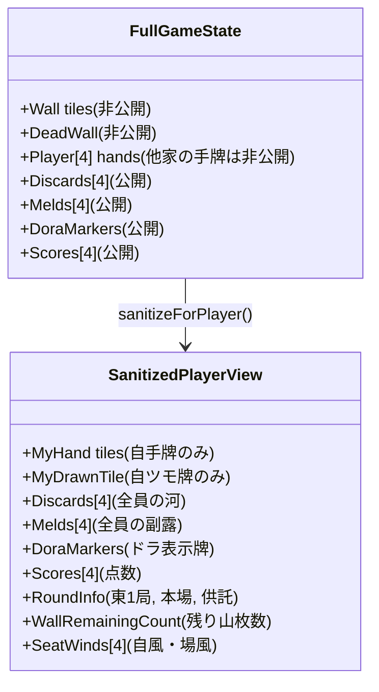

# ARCHITECTURE.md - システムアーキテクチャ設計書

本ドキュメントでは、ブラウザ麻雀ゲームおよびハイブリッドAI牌読みコーチングシステム（Direct API / Cloudflare Pages / ローカルCLI / ルールベース）の全体構造を定義します。

---

## 1. システム全体構成図（ハイブリッドAIアーキテクチャ）

```
+---------------------------------------------------------------------------------------------------------+
| ブラウザ (Client - React + Vite + Tailwind CSS) [Cloudflare Pages 静的ホスティング対応]                |
|                                                                                                         |
|  +-----------------------------------+  +------------------------------------------------------------+  |
|  |           麻雀卓 UI               |  |                   AI牌読みコーチ パネル                    |  |
|  | - 自手牌 / ツモ牌表示 (TileView)  |  | - 局面サマリー表示 (Markdown)                             |  |
|  | - 4家の河 (捨て牌 / リーチ棒)    |  | - ワンクリック質問ボタン (何切る/危険牌/符計算/押し引き)   |  |
|  | - 副露 (ポン/チー/カン)           |  | - ⚙️ AI設定モーダル (Gemini / Claude APIキー, BYOK管理)    |  |
|  | - 点数表示 / ドラ / 場風・自風    |  | - プロバイダー自動選択・ステータスバッジ                   |  |
|  +-----------------+-----------------+  +-----------------------------+------------------------------+  |
|                    |                                                  |                                 |
|                    v                                                  v                                 |
|  +---------------------------------------------------------------------------------------------------+  |
|  |                               麻雀ゲームステート管理 (React Hook)                                  |  |
|  | - ターン進行 / ユーザー操作受付                                                                    |  |
|  | - SanitizedPlayerView 抽出 (相手の非公開手牌や山牌を厳格に物理遮断)                                |  |
|  +-----------------+--------------------------------------------------+------------------------------+  |
|                    |                                                  |                                 |
|                    |                                                  v                                 |
|                    |                   +-------------------------------------------------------------+  |
|                    |                   | AIコーチ統合ルーター (askAICoach / coachService)            |  |
|                    |                   +-------+--------------------+-------------------+------------+  |
+--------------------|---------------------------|--------------------|-------------------|---------------+
                     |                           |                    |                   |
        [Gemini Direct API]        [Claude Direct API]       [ローカルCLIサーバー]      [ルールベース]
                     |                           |                    |                   |
                     v                           v                    v                   v
+-----------------------------+ +-----------------------------+ +-------------------+ +-------------------+
| Google AI Studio API        | | Anthropic Claude API        | | Node.js Express   | | Pure TypeScript   |
| (gemini-2.5-flash 等)       | | (claude-3-5-haiku 等)       | | (ポート 3001)     | | 牌読み分析エンジン|
| - ブラウザ直接HTTPS         | | - direct-browser-access     | | - agy CLI 呼び出し| | (現物/筋/壁/点数) |
| - 無料枠 1日1500回          | | - 高精度・低レイテンシ      | | - claude CLI 実行 | | - 完全オフライン  |
+-----------------------------+ +-----------------------------+ +-------------------+ +-------------------+
```

---

## 2. モジュール設計と責任分離

### (1) Core モジュール (`src/core/`)
- **UI非依存**: React やブラウザAPIに依存しない純粋な TypeScript ロジック。
- **データモデル**: 牌、手牌、副露、河、山、局、点数等の型定義。
- **ルールエンジン**:
  - 牌山管理（配牌、ツモ、ドラ表示、王牌）
  - シャンテン数計算、有効牌（受け入れ枚数）計算
  - 和了形判定（面子手、七対子、国士無双）
  - 役判定、符計算、翻数計算、点数授受
  - フリテン判定、リーチ判定、鳴き可否判定

### (2) AIモジュール (`src/ai/`)
- **不完全情報サニタイザー (`sanitizeForPlayer`)**:
  - `GameState`（完全情報）から指定プレイヤーの視点情報のみを抜き出した `SanitizedPlayerView` を生成。
- **プロンプトフォーマッタ (`contextFormatter.ts`)**:
  - 局面データをLLMが最も推論しやすいMarkdown形式へ整形。
- **ルールベース牌読みエンジン (`ruleBasedCoach.ts`)**:
  - 筋、壁、現物、無筋危険牌、手牌シャンテン数・受け入れ最大打牌、打点・符計算のロジカルな分析エンジン。
- **マルチプロバイダーAIサービス (`src/ai/services/`)**:
  - `geminiDirectClient.ts`: Google Gemini REST API 直接呼び出し
  - `claudeDirectClient.ts`: Anthropic Claude Messages API 直接呼び出し
  - `coachService.ts`: Direct API / ローカルCLI / ルールベースの統括ルーター
  - `storage.ts`: `localStorage` での安全なキー管理

### (3) ローカルCLIブリッジ (`server/`) [オプション]
- **CLI Runner**:
  - Node.js の `child_process` を用いて、ローカルにインストールされた `agy` または `claude` コマンドを実行。
  - ローカル開発時やCLIで深くデバッグしたい場合に利用可能。

### (4) サーバーレスプロキシ (`functions/`) [Cloudflare Pages対応]
- `functions/api/coach/proxy.ts`: Cloudflare Pages Functions 経由で安全にGemini APIを中継。

### (5) UIコンポーネント (`src/components/`)
- **MahjongTable**: 4人対局盤面（中央センターボックス、自手牌、他家河・手牌）。
- **TileView / MahjongTile**: ベクターSVGを用いた高品質な麻雀牌描画。
- **AICoachPanel**: 対局画面右側のチャットパネル。
- **AISettingsModal**: ⚙️ AIプロバイダーおよびAPIキー設定ダイアログ。

---

## 3. 不完全情報（情報遮断）の保証設計



- `SanitizedPlayerView` には `opponentsHands` や `wallTiles` を保持するフィールド自体が存在しないため、物理的に情報が漏洩しない構造となっています。
